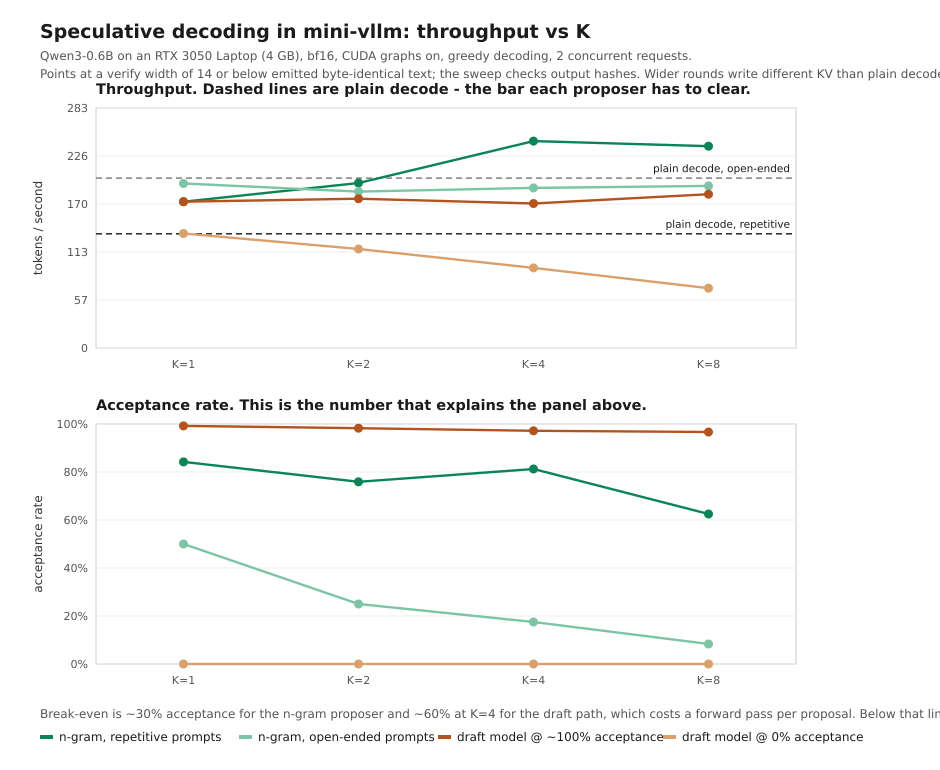

# mini-vllm

mini-vllm is a lightweight LLM inference engine built from scratch for learning and experimentation. The implementation stays intentionally small so the main execution flow is easy to inspect.

## What It Supports

- Qwen3 models are the primary target today.
- Gemma3 support is also present in the model tree.
- Continuous batching for improved throughput.
- CUDA graph execution.
- KV cache management for generation.
- Prefix caching.
- [Speculative decoding](#speculative-decoding) with two interchangeable
  proposers — a draft model, or an n-gram lookup that needs no model at all.

## Requirements

- Python 3.10+ is recommended.
- A CUDA-capable GPU is required for the current setup.
- Install the project dependencies from [requirements.txt](requirements.txt).

## Install

Create an environment, install dependencies, and download a compatible model:

```sh
pip install -r requirements.txt
hf download Qwen/Qwen3-0.6B
```

The demo scripts expect the model to be available locally. By default they look for `~/huggingface/Qwen3-0.6B/`.
One dependency, `mini-flash-attention`, is pulled from GitHub because it is not published on PyPI.

## Run

Interactive chat:

```sh
python chat.py --model ~/huggingface/Qwen3-0.6B/
```

The chat session supports these commands:

- `/help` shows available commands.
- `/clear` clears the conversation history.
- `/history` prints the current conversation.
- `/system <text>` updates the system prompt.
- `/maxtokens <num>` changes the generation limit.
- `/top-k <num>` adjusts top-k sampling.
- `/top-p <float>` adjusts nucleus sampling.
- `/temperature <float>` changes sampling temperature.
- `/settings` prints the current configuration.
- `/exit` closes the session.

Scripted inference demo:

```sh
python run.py
```

Benchmark the mini implementation:

```sh
python benchmark/run_mini_vllm.py
```

Compare against vLLM:

```sh
python benchmark/run_vllm.py
```

The benchmark scripts load repeated prompts and report throughput in tokens per second, which makes it easy to compare this implementation with vLLM on the same model.

Sweep the speculative decoding proposers and regenerate the chart below:

```sh
python benchmark/spec_sweep.py
```

## Speculative Decoding

*Original work — this feature has no nano-vllm equivalent.*

Decoding is memory-bound: a step spends almost all of its time moving weights,
and moving them for one token costs about what moving them for five does.
Speculative decoding exploits that. A cheap **proposer** guesses the next K
tokens, the target model scores all K+1 positions in **one** forward pass, and a
**rejection sampler** keeps the longest prefix that the target would have
produced anyway. Between 1 and K+1 tokens come out of a step that costs roughly
one.

The guarantee is the interesting part: rejection sampling is *exactly*
distribution-preserving. The output does not approximate what the target would
have said — it is drawn from the target's own distribution, whatever the
proposer guessed. A bad proposer costs speed and nothing else.

### Two proposers behind one verify-and-accept core

Set `Config.speculative_method`:

| method | how it proposes | cost per round (K=4) | break-even acceptance |
|---|---|---|---|
| `"draft"` | a small model, run K times | 19.9 ms | ~60% |
| `"ngram"` | look the last few tokens up in the request's own history | 12.6 ms | ~30% |

(A plain decode step costs 8.9 ms on the same host, so those are 2.24x and 1.41x
of the thing they replace.)

The second one needs no parameters, no training and no KV cache. It works
because a *deterministic* proposer has a one-hot proposal distribution — exactly
what a greedy draft model produces — so `Executor.verify`,
`Sampler.rejection_sample` and the scheduler cannot tell the two apart. Adding
it touched `Executor.propose` and nothing downstream of it.

```python
Config(
    model="~/huggingface/Qwen3-0.6B/",
    use_speculative_decoding=True,
    speculative_method="ngram",     # or "draft", with draft_model=...
    num_speculative_tokens=4,       # K
)
```

### Results



Reproduce with `python benchmark/spec_sweep.py` (~10 minutes; every
configuration runs in its own process, because engines built back to back in one
process inherit each other's warm compilation state and stop being comparable).

**The n-gram proposer is worth 1.81x at K=4 on text that repeats itself, and a
~5% loss on text that does not.** Both halves of that sentence are the result.
Lookup has nothing to propose on open-ended generation, where the last few tokens
have simply never occurred before — it is not a general-purpose accelerator, and
the sweep measures both cases rather than picking the flattering one.

| proposer | workload | tok/s | vs plain decode | acceptance |
|---|---|---|---|---|
| plain decode | repetitive | 135 | 1.00x | — |
| **n-gram, K=4** | repetitive | **244** | **1.81x** | 81% |
| plain decode | open-ended | 200 | 1.00x | — |
| n-gram, K=4 | open-ended | 189 | 0.94x | 18% |
| draft model, random init | open-ended | 94 | 0.47x | 0% |
| draft model, target self-drafts | open-ended | 170 | 0.85x | 97% |

The last two rows bound the draft-model path from both sides. A random-init draft
is the *cost* of a round before any proposal quality exists; the target drafting
for itself is the *acceptance ceiling* nothing can beat. A trained draft lands
between them, which is why training one is filed under
[future upgrades](docs/future_upgrades.md) rather than done.

The loss is bounded by *declining to speculate*: when no request in a batch has
a match, the round is skipped and a plain decode step runs instead. Without
that, open-ended text would pay ~1.4x per step for a token it could have had for
1.0x. `Metrics.speculation_rate` reports how often a round actually ran, and it
should always be read next to the acceptance rate.

### What actually made it work

Not the proposer. **CUDA graphs.** The first measurement had speculation running
10-21x slower per step than plain decode, which made break-even need more
accepted tokens than a round even proposes — impossible at *any* proposal
quality. The cause was kernel-launch overhead, not guess quality: a graphed
decode step is ~8x faster than an eager one for a 0.6B model on this hardware,
and the speculative path was not capturing graphs.

It was not capturing them because a verify pass "obviously" is not decode-shaped.
It is: the constraint is one query row per *batch entry*, not per request, and a
request's K+1 tokens ride in the batch dimension. Once the runner was sized at
`max_num_batched_seqs * (K+1)`, a K=4 round went from 134.9 ms to 19.9 ms and
break-even from impossible to ~60%.

That is why the chart plots acceptance rate underneath throughput. On a 0.6B
model on a laptop GPU — close to the least favourable case for this technique,
whose reputation comes from 7B+ models where fixed overheads vanish — the
question is never only "how good is the proposer".

### A limit worth knowing about

Byte-identical output has a **measured batch-width ceiling**. A verify pass over
`num_requests * (K+1)` rows is a wider GEMM than a decode step, and past width 14
on this hardware cuBLAS retiles and the projection writes *different K/V into the
cache* for the same token. Unlike logit noise that is permanent: both runs keep
decoding, but no longer over the same numbers, and they diverge later at a step
that need not be a near-tie at all.

The output stays correct — rejection sampling is still exactly
distribution-preserving, so a wide round emits a valid sample from the target —
but it is no longer the *same* sample. So byte identity holds while
`num_requests * (K+1) <= 14`, which at 2 concurrent requests means K <= 6.
`experiments/kv_shape_drift.py` measures the threshold and the sweep classifies
mismatches against it rather than widening the gate until everything passes.

Finding this is what the output-hash check in the benchmark was for.

### Correctness

Speculative decoding fails *silently*. A subtly wrong verify pass keeps emitting
fluent text; it is just not the text the model would have produced. So the
regression suite tests output equality, not throughput:

```sh
pytest tests/ -m "not gpu"   # the maths and the proposer, no GPU needed
pytest tests/                # adds one-round tests against the real model
pytest tests/ --slow         # adds full Engine.generate comparisons
```

Three levels, cheapest first: the rejection sampler's output distribution
matches the target's to within 5 sigma over 20k trials; one `verify()` pass
equals K+1 sequential decode steps, with acceptance scripted across every M from
0 to K; and greedy output through `Engine.generate` is byte-identical with
speculation on and off. The suite is mutation-checked — deliberately broken
implementations were confirmed to fail it — because a green suite proves nothing
on its own. The benchmark sweep is a fourth gate: it hashes the tokens each
configuration produced and refuses to plot a divergence.

Two findings worth recording from building it:

- **The backend had a real bug.** `mini-flash-attention`'s decode kernel aliases
  its cross-warp softmax reduction over the same shared memory as its output
  accumulator with no barrier between them, which makes decode nondeterministic
  and wrong at batch width >= 6 — the same call twice returned logits differing
  by up to 21.7. A verify pass runs at width `num_requests * (K+1)`, so it hit
  this immediately. The fix is one `__syncthreads()`, kept in `patches/`.
- **Byte-identical output is a tolerance, not a theorem.** Batch shape alone
  moves logits by up to 0.5 absolute in bf16 (cuBLAS retiles per shape, nothing
  to do with speculation), so a near-tie can flip a token without anything being
  wrong. Every gate states its claim against a *measured* noise floor rather
  than against zero.

Design notes, phase-by-phase results and the full measurement log are in
[PROGRESS.md](PROGRESS.md); what is deliberately *not* built yet, and why, is in
[docs/future_upgrades.md](docs/future_upgrades.md).

## Notes

- The scripts use Hugging Face chat templates and `enable_thinking=True` for Qwen3-style prompts.
- If you use a different model, update the local model path in the scripts or pass it to `chat.py` with `--model`.

## References

This project was developed with inspiration from:

- [vLLM](https://github.com/vllm-project/vllm)
- [nano-vllm](https://github.com/GeeeekExplorer/nano-vllm)
